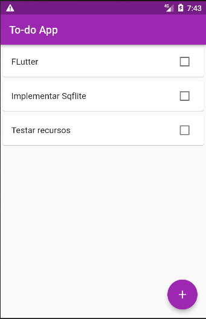
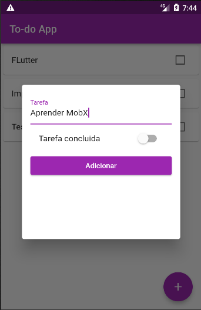
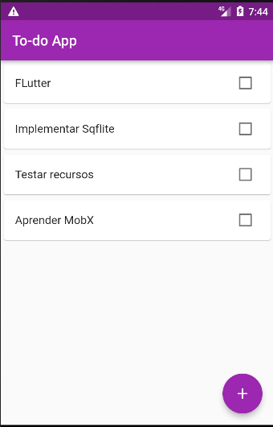

# TodoList

Este é um aplicativo simples feito em Flutter que irá permitir ao usuário criar uma lista de
tarefas. O usuário poderá incluir as tarefas a serem feitas e marcar estas tarefas como concluidas.

Versão: 1.0

- Cria uma tarefa e a marca como concluída, ela ainda não persiste no aparelho é somente temporária.

### Snapshot da tela

#### Adicionando uma tarefa

### Visualizando a tarefa inclusa

#### Avisos

Este é um projeto publico, podendo ser utilizado por qualquer um que tenha interesse, sem precisar pagar nada por isto.
