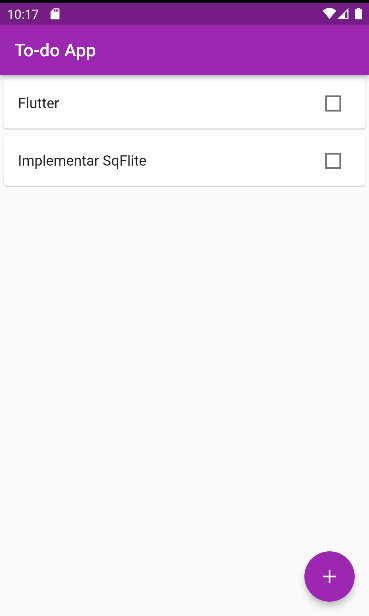

# TodoList

Este é um aplicativo simples feito em Flutter que irá permitir ao usuário criar uma lista de
tarefas. O usuário poderá incluir as tarefas a serem feitas e marcar estas tarefas como concluidas.

Historico de Versão:

- 1.0 19-06-2022
- 1.1 20-06-2022
- 1.2 25-06-2022 (atual)

---

Este aplicativo consegue

- Criar uma tarefa e já marcar como concluida
- Criar marcar / desmarcar uma tarefa como concluida
- Excluir uma tarefa pré-selecionada

### Snapshot da tela

#### Adicionando uma tarefa

### Visualizando a tarefa inclusa

### Marcando para exclusão

### Vendo a tarefa excluida na tela

#### Avisos

Este é um projeto publico, podendo ser utilizado por qualquer um que tenha interesse, sem precisar pagar nada por isto.

Ele exibe conceitos iniciais de trabalho com Provider (gerencia de estado), banco de dados Sqflite e como lidar com este fluxo entre Provider e Sqflite.
